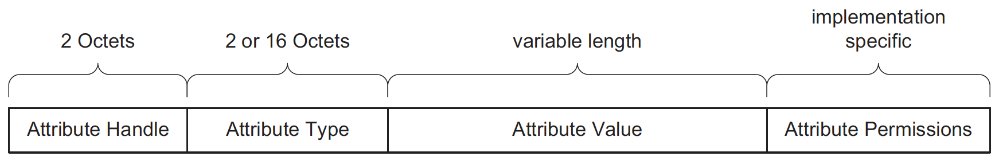

# [GATT](https://www.novelbits.io/bluetooth-gatt-services-characteristics/)

## 1. Attribute Protocol(ATT)
> ATT 定义了server的数据结构和如何暴露数据给client:ATT有两种角色

1. Server (蓝牙音箱)
2. Client (手机)

#### 1. server数据结构称为属性(attributes)
> For example, services and characteristics (both described later) are types of attributes

1. Attribute type (Universally Unique Identifier or UUID)
2. Attribute Handle(think of it as an address)
3. Attribute Permissions (定义是否可读写notify等。)

## 2.The Generic Attribute Profile (GATT)

- Services
- Characteristics
- Profiles

## 3.Services and Characteristics

#### 1.Services
1. 最好不要把不相关的characteristic放在同一个Services里
2. Bluetooth SIG 定义了一些Services 需要遵循协议

#### 2.Characteristics
#### 3.Profiles

## 4.GATT设计准则
1. 确保实现强制实现的service和characteristics
	- Generic Access Profile (GAP) service.
	- Name and Appearance characteristics within the GAP service.

2. 考虑一下第三方蓝牙库一般提供接口可修改蓝牙名称或者
3. 最好遵循SIG
4. 一个service只包含相关的characteristics
5. 避免一个service有太多的characteristics

