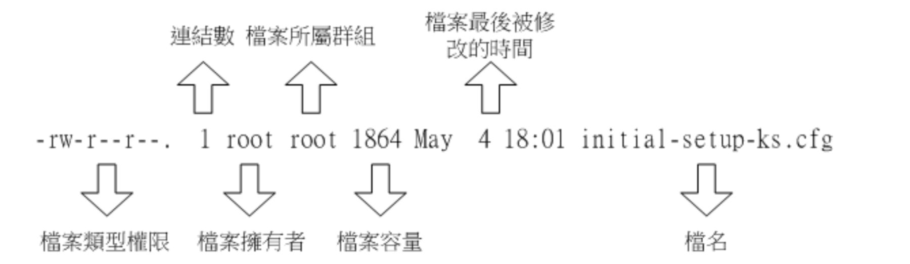
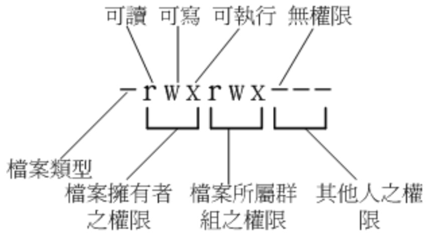

## 1. 文件权限

1. 文件属性

	1. 文件rwx分别代表读-写-执行
	2. 目录x代表是否可以进入目录, w决定了内部文件是否能被删除
					
	----------			
	
	--------
	
	-----
	

		
2. 修改权限

	1. chgrp: 改变文件所属群组
	2. chown: 改变文件所有者
		- `chown [-R] 账号名称 文件或目录` , -R表示递归目录下的所有文件
		- `chown root:root test.txt` 修改`test`文件的所有者和群组
	3. chmod: 改变文件的权限

		1. r:4 w:2 x:1 
		2. rwx = 4 + 2 + 1 = 7
		3. 通常用vim编辑一个shell文件后,权限为664,是不可执行的。可以修改为755

## 2.目录
1. `$PATH`关联了一些路径.如`ls`命令在任何情况下都可以使用,就是因为会搜寻`$PATH`下`ls`可执行命令
	
## 3.vi
1. 3中模式	
	1. 一般指令模式,用vi打开一个文件处于指令模式
	2. 编辑模式, 按下`『i, I, o, O, a, A, r, R』`进入编辑模式。`esc`退出编辑模式
	3. 指令列命令模式, 一般模式下输入`『 : / ? 』`会进入此模式。光标会移动到最底下一列。

## 4.Bash
> 侠义的shell指的是指令列方面的软件,包括bash

1. 命令别名
	
		alias lm='ls -al'
2. 变量
		
		//1.变量与变量内容以一个等号『=』来连结，不能有空格
		『myname=VBird』
		//2.变量内容若有空格符可使用双引号『"』或单引号『'』将变量内容结合起来
		//双引号中会解析变量
		『var="lang is $LANG"』则『echo $var』可得『lang is zh_TW.UTF-8』
		//单引号不会解析变量
		『var='lang is $LANG'』则『echo $var』可得『lang is $LANG』
		
		//3.使用unset取消变量
		unset name
		
## 5.用户与群组
1. 新增用户 
	
	 	 
	 	 //新增用户,默认群组名称与用户名称一致
	 	 useradd wl
	 	 //设定用户密码
	 	 passwd wl
	 	 //删除用户 -r连家目录一起删除
	 	 userdel  [-r] username 
2. 新增与移除群主
		
		//新增群组
		groupadd intelligentkitchen
		groupdel intelligentkitchen
		 
		
## 常用命令

- `cp` 复制文件或目录,源文件 目标文件 
- `rm` 删除
- `mv` 移动
- `mkdir` 创建目录
- `rmdir` 删除目录
- `touch` 新建空文件
- `cat`  读取文件内容
- `cd`
		
	1. `.` 此层目录
	2. `..` 上层目录
	3. `-` 前一个工作目录
	4. `~` 目前用户的家目录 

- `pwd` 显示当前目录
- `umask` 文件预设权限,决定了新建文件的权限
     	
     	0022 ->第一个数字不用管, 后3个数字是被减去的权限 
     	022表示了新建文件或目录的权限为 rwxrw-rw-

##### 1. 压缩,打包
- `gizp 文档名` 压缩 `gzip -d` 解压缩
- `tar` 打包